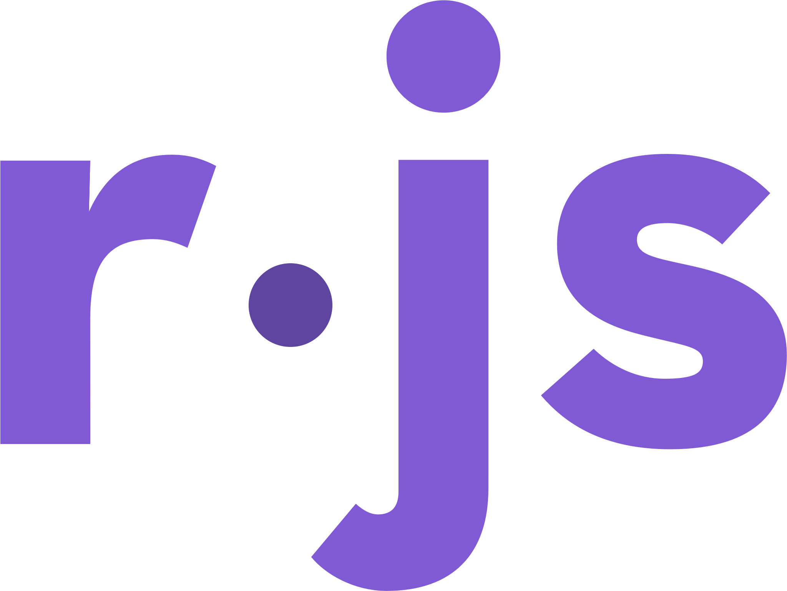

<div align="center">
  <br />
  <p>
    </a>
  </p>
  <br />
  <p>
    <a href="https://www.npmjs.com/package/ruqqus-js"></a>
    <a href="https://www.npmjs.com/package/ruqqus-js"></a>
    <a href="https://david-dm.org/acikek/ruqqus-js"></a>
    <a href="https://github.com/acikek/ruqqus-js/blob/master/LICENSE"></a>
  </p>
  <p>
    <a href="https://nodei.co/npm/ruqqus-js/"></a>
  </p>
</div>

## About

ruqqus-js is a [Node.js](https://nodejs.org) module and wrapper of the [Ruqqus](https://ruqqus.com) API.

- Designed for Ruqqus Applications
- Object-oriented
- Efficient, optimized
- Ever-adapting to the Ruqqus API

## Setup

### Installation
To install the NPM package: `npm i ruqqus-js`<br>
**Requires Node.js v12.0.0 or newer.**

### Creating a Ruqqus Application
If you do not have an authorized Ruqqus Application already, you must submit an API Key Request form in the [apps tab of Ruqqus settings](https://ruqqus.com/settings/apps). Keep in mind that approval is not guaranteed and it could take up to a day for the Ruqqus admins to approve your request.

### Acquiring an Authcode
Once you have your Application ID and client secret, you will need to acquire an authentication code ("authcode" for short). This will let the package automatically grant to the OAuth2 endpoint and retrieve an access token. 

To acquire an authcode, you will need to generate a Ruqqus OAuth2 URL.

#### Manual URL Generation

Start with `https://ruqqus.com/oauth/authorize` and add the following URL parameters:

- `client_id` - Your application's Client ID
- `redirect_uri` - The redirect URI (or one of the URIs) specified in your application information. Must not use HTTP unless using localhost (use HTTPS - 
instead).
- `state` - This is your own anti-cross-site-forgery token. Ruqqus doesn't do anything with this, except give it to the user to pass back to you later. You are responsible for generating and validating the state token.
- `scope` - A comma-separated list of permission scopes that you are requesting. Valid scopes are: `identity`, `create`, `read`, `update`, `delete`, `vote`, and `guildmaster`.
- `permanent` - optional. Set to `true` if you are requesting indefinite access. Omit if not.

#### Automatic URL Generation

ruqqus-js provides two functions for automatically generating an OAuth2 URL: `getAuthURL()`, which takes parameters in the function arguments, and `getAuthURLInput()`, which takes the parameters in the console. Below is an example of the former.

```js
const { getAuthURL } = require("ruqqus-js");

console.log(getAuthURL({
  id: "CLIENT_ID",
  redirect: "REDIRECT_URI",
  state: "STATE_TOKEN",
  scopes: "SCOPE_LIST",
  permanent: true
}));
```

### Completing the Setup

If you did everything correctly, the URL should take you to an Authorization page, which should subsequently take you to your specified redirect URI. The authcode should be in the URL; keep in mind that every code has a **one-time use**. Follow the code in the [example section](#example) with the client parameters to run your bot.

## Example

```js
const Ruqqus = require("ruqqus-js");

const client = new Ruqqus.Client({
  id: "CLIENT_ID",
  token: "CLIENT_SECRET",
  code: "AUTHCODE"
});

client.on("ready", () => {
  console.log(`Logged in as ${client.user.username}!`);
});
```

## Links

- [Documentation](https://github.com/acikek/ruqqus-js/wiki)
- [Ruqqus API Discord Server](https://discord.com/invite/GWRutXB)
- [GitHub](https://github.com/acikek/ruqqus-js)
- [NPM](https://npmjs.com/package/ruqqus-js)

### Developer Links

- [Ruqqus OAuth2 Help Page](https://ruqqus.com/help/oauth)
- [Unofficial API Documentation](https://drive.google.com/file/d/1dFzkVxidCHpvnUUTaYtLu6Cu7Wh0oeni/view)

## Contributing

Please check if an issue has already been reported or suggested before creating a new one. Make sure to also review the [documentation](https://github.com/acikek/ruqqus-js/wiki). Feel free to open a Pull Request if you find something noteworthy enough to change.

Most of the discussion regarding support/suggestions happens on the [Ruqqus API Discord Server](https://discord.com/invite/GWRutXB), so don't hesitate to join if you have any questions.